# 企业应用开发平台

#### 介绍
  osbpm企业应用开发平台已加入openEA定向开源计划，平台由广州市联科软件有限公司自主研发，底层未采用任何开源框架，严格遵照开源协议Mozilla Public License（MPL） 2.0开放源代码。为保证质量，减少企业应用风险，在初期实施定向开源策略，只有加入openEA定向开源计划的企业或个人才能免费使用开源平台。  osbpm以流程应用开发平台为基础，松耦合各个模块组合，包括组织架构、流程引擎、门户组件、移动端组件、表单设计器、流程设计器等，拥有快速扩展各功能组件和业务实例的能力。

 

#### 软件架构

  

1、产品架构图

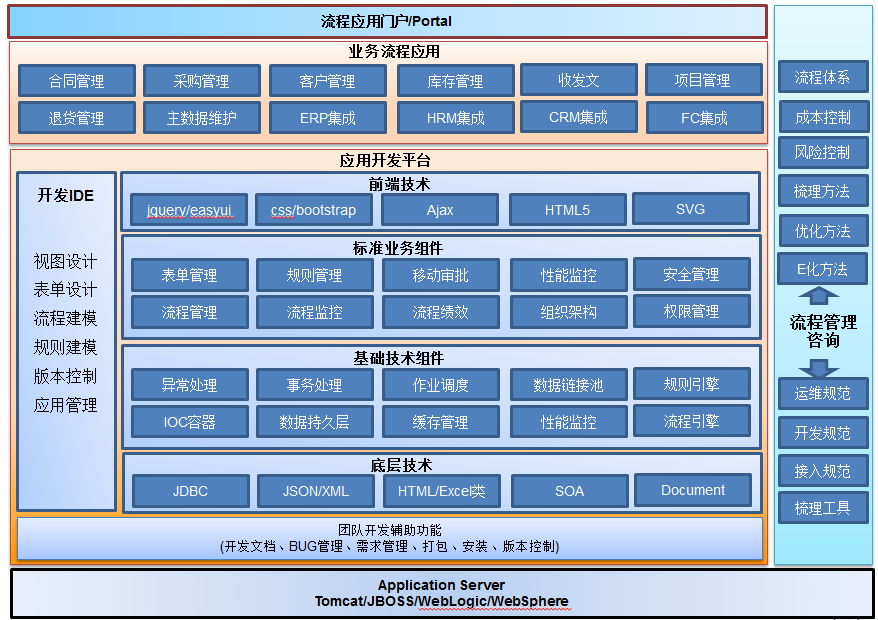

 

2、技术架构图

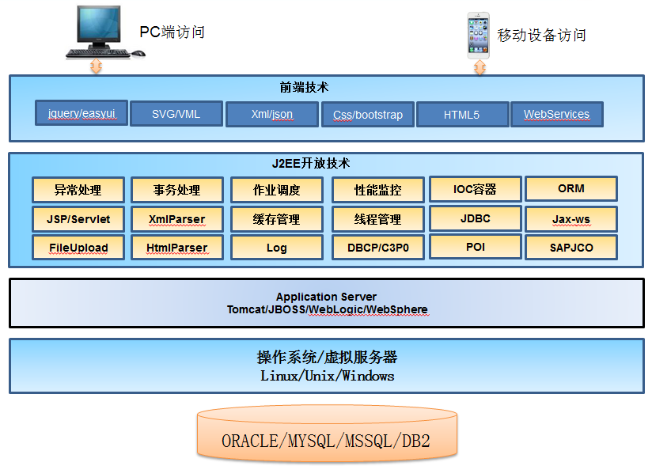

3、流程管理

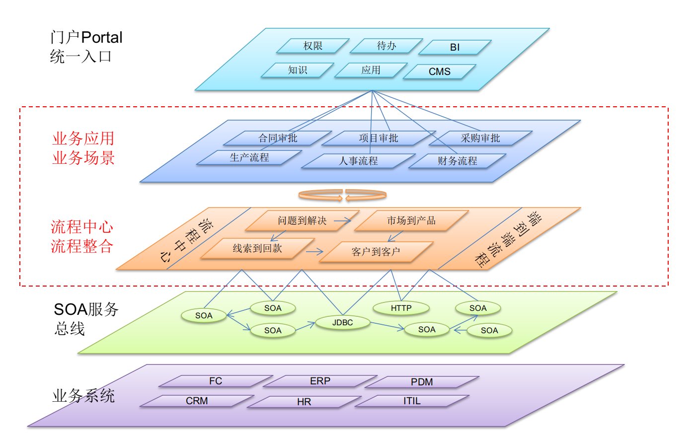 

#### 安装教程

 

**1、准备环境**

​	①  运行容器：Tomcat8 【推荐Tomcat-8.0.36】

​	②  运行环境：JDK 1.8 

​	③  数据库：MySQL 5.1.40+ 【ORACLE11g、SqlServer2008+、MariaDB需要对应的版本】

​	④  eclipse环境【平台使用eclipse作为IDE开发，idea需要自行配置】

​	⑤  基础运行环境：window/mac/linux，虚拟机亦支持。

​        资源下载地址：

​        http://knowledge.linkey.cn:8000/d/b981f1c1e6/

 

**2、源码部署**

[平台源码开发及部署方案.pdf](./document/平台源码开发及部署方案.pdf)

**特别注意**

一般不会将源码直接部署到生产环境，需先通过打包成war包，然后再独立部署到Tomcat中运行；

部署成功后访问地址：

<http://localhost:8080/osbpm_dev>

​	

#### 使用说明

入门指南：https://shimo.im/docs/f24926079a684d60/read

接口文档：http://knowledge.linkey.cn:6660/showdoc/web/#/6?page_id=20

知识百科(openEA_WIKI):  <http://www.openea.net/index.php/%E9%A6%96%E9%A1%B5>

代码托管(openEA_GIT)	:  <http://git.openea.net/osbpm-develplatform/source-LinkeyBPM-enterprise>

openEA_WIKI和openEA_GIT为专注于行业流程应用领域的知识百科和代码托管服务器；

 

# 部分功能展示

1、用户端首页【可以自定义，这个是默认首页】

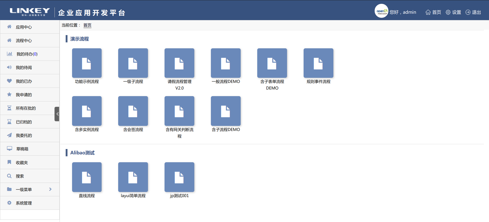

2、开发端后台

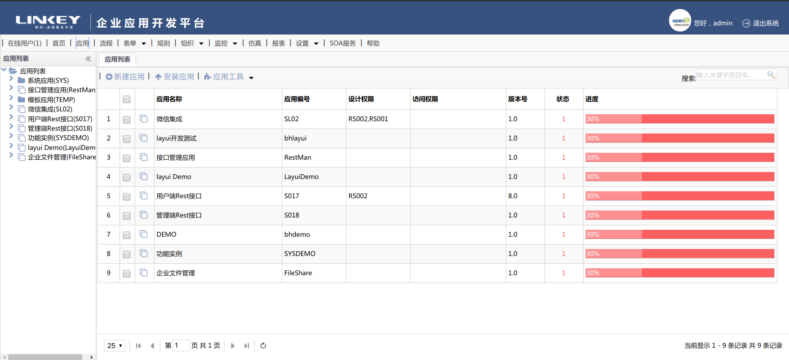

3、平台监控

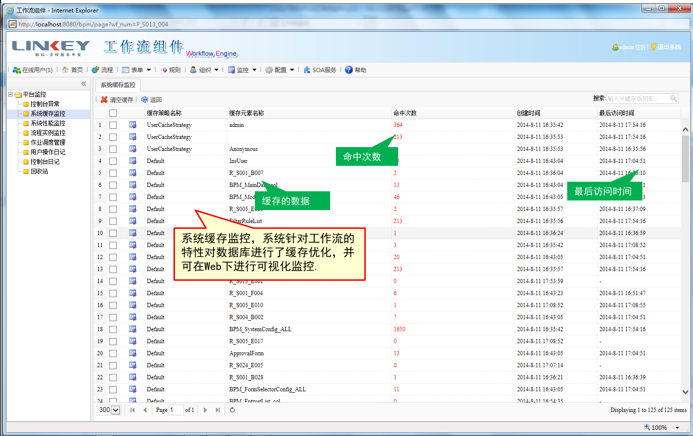

4、流程建模

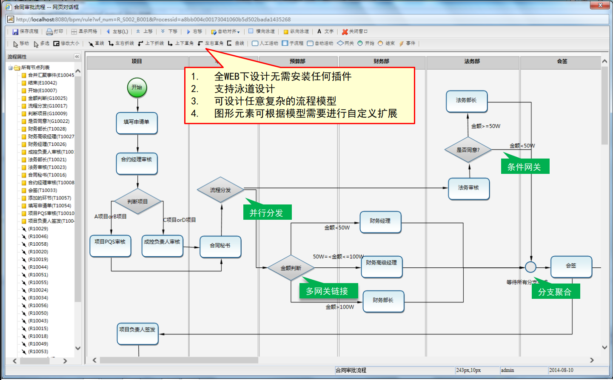

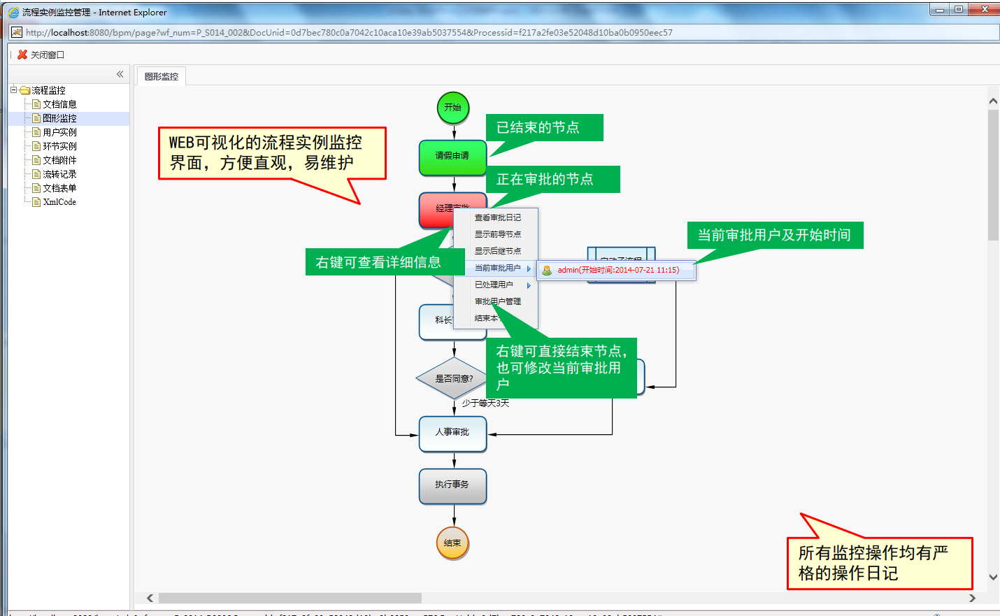

5、表单建模

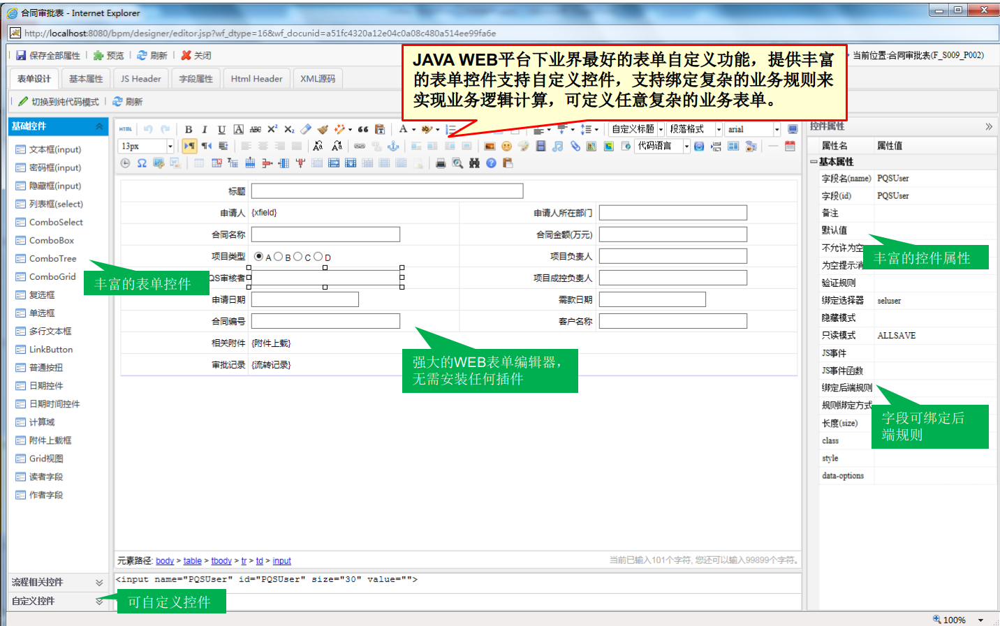

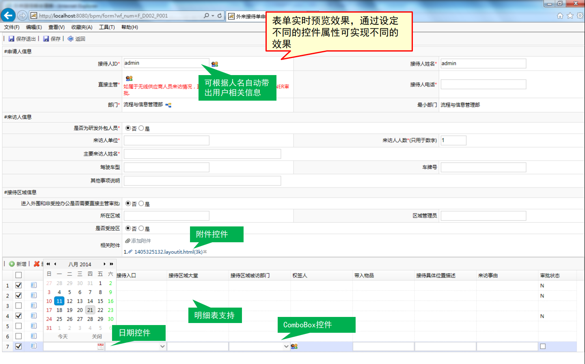

6、在线规则

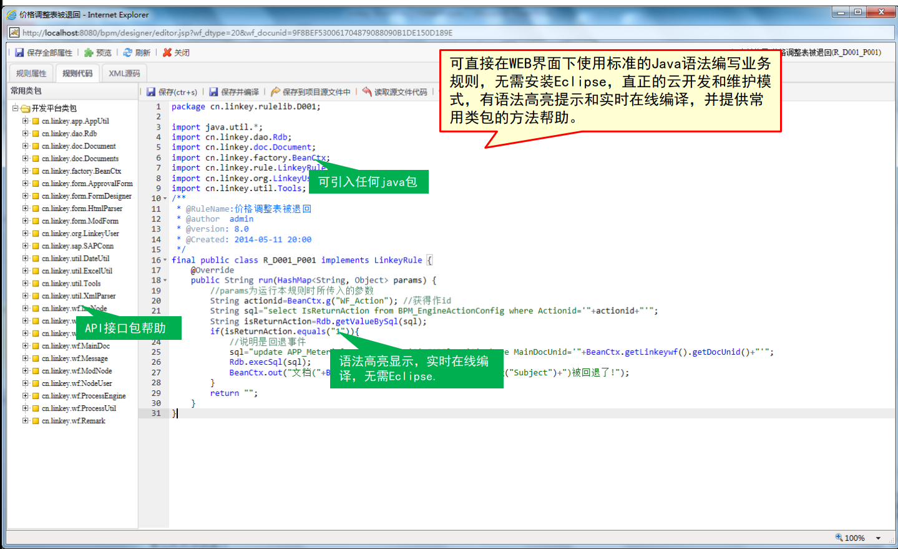

7、还有各种模块功能，如组织架构、定时任务、Rest和SOA接口服务、系统集成等；

# osbpm开源声明

 

osbpm企业应用开发平台已加入openEA定向开源计划，平台由广州市联科软件有限公司自主研发，底层未采用任何开源框架，严格遵照开源协议Mozilla Public License（MPL） 2.0开放源代码。您可通过代码托管平台（GitHub、码云、openEA_GIT）自由下载、学习、测试、使用等。

 

为保证质量，减少企业应用风险，在初期实施定向开源策略，只有加入openEA定向开源计划的企业或个人才能免费使用开源平台。

 

因此，在安装部署平台前，您还需要加入openEA定向开源计划获取数据库文件，平台支持多种数据库类型（MySQL、ORACLE、SQL Server、MariaDB），此次免费开源MySQL版本。

 

获取数据库步骤如下：

1、 扫码关注“openEA开源社区”公众号；

 

2、 公众号后台回复“数据库”，按照提示操作加入openEA定向开源计划，即可获取。

备注：此操作只做风险管控，绝无产生任何费用。

 

为提高服务质量，解决产品问题，我们成立相关技术交流群，欢迎加入。

QQ群（入群请备注“下载渠道”，需等待管理员审核）

1、 openEA开源技术交流01（已满）

2、 openEA开源技术交流02：748293464

3、 openEA开源技术交流03：191456154

 

\* 本次声明最终解释权归广州市开放邑软件科技有限公司所有。