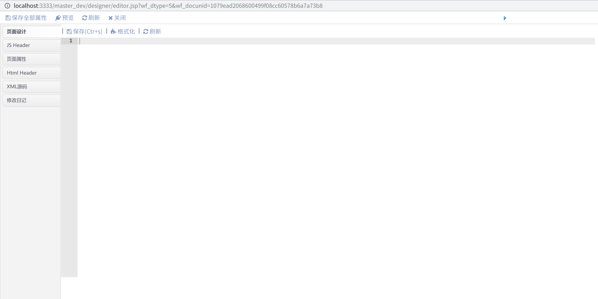

```diff
- openEA开源社区，请登录后查看更多内容！
```


# 适用版本

* 修改版本：LinkeyBPM_12_3
* 适用版本：LinkeyBPM_9_0以上版本，其他版本可以参考修改


# 问题|优化

**更新平台代码编辑器**

* 解决输入中文多余字符；
* 编写代码没有提示问题(JS/Java)；
* 新增自定义代码提示(JS/Java)；


# 解决思路&方案

* 1、更新最新版本编辑器，并进行相应参数调整；

* 2、创建配置提示的JSON文件，如linkeyJava.json和linkeyJS.json文件；
* 3、在编辑器中引入以上JSON文件；
* 4、创建规则扫描类，对Java方法以及JS提示内容进行处理；
* 5、除默认扫描外，创建自定义配置视图，允许自定义配置提示；


# 使用手册

* 1、将solution_files目录下的ace目录覆盖至linkey\bpm\editor\ace目录；
* 2、将solution_files下的designer目录覆盖至linkey\bpm\designer目录；
* 3、在S001中导入表结构“BPM_CodeHintingConfig-表结构.xml”，初始化实体表；
* 4、在平台公共设计中，点击导入设计元素，依次导入（需要步骤2先创建实体表）；


# 测试

* 在线编辑输入中文问题测试 【正常】

* 测试在线编辑Java提示


* 测试在线编辑JS提示


* 测试html代码提示



* 测试自定义关键词提示


* 测试配置jar提示


# 项目地址

* 源码地址：http://git.openea.net/osbpm-platformpack/201911-fix-aceupdate
* WIKI地址：http://www.openea.net/index.php?title=%E5%B9%B3%E5%8F%B0%E7%BC%96%E8%BE%91%E5%99%A8%E5%8D%87%E7%BA%A7


# 技术交流群

1、QQ 群 （入群请 备注 下载渠道，需等待管理员审核）

- OpenEA开源技术交流02：748293464 

2、 扫码关注“openEA开源社区”公众号；


