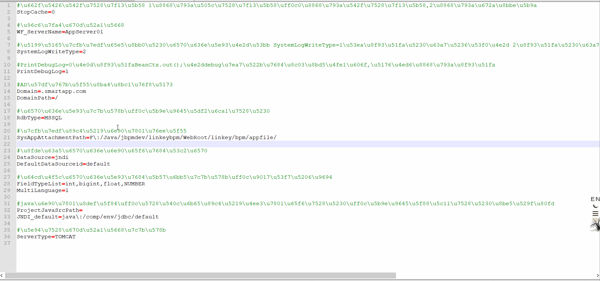
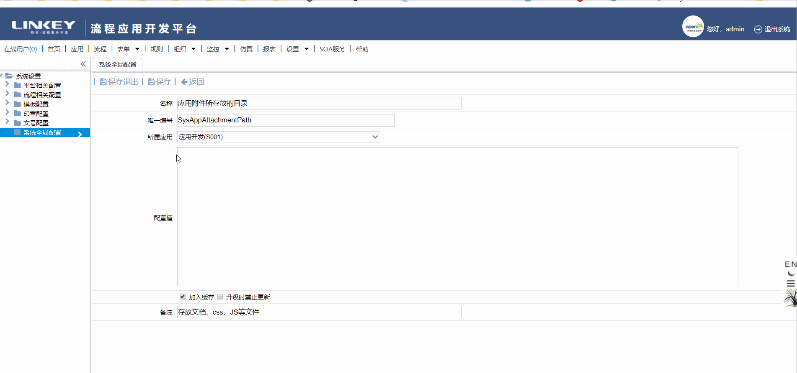

```diff
- openEA开源社区，请登录后查看更多内容！
```


# 适用版本

* 修改版本：LinkeyBPM_12_3
* 适用版本：LinkeyBPM_9_0以上版本，其他版本可以参考修改


# 问题|优化

应用上传附件路径配置，原来是通过config.properties并不方便，需要新增web端的配置


# 解决思路&方案

* 确定配置流程：默认使用全局配置SysAppAttachmentPath，保留config.properties配置，若两者均为空的时候内置使用：tomca项目t地址 +  linkey/bpm/appfile/
* 全局配置SysAppAttachmentPath可以是相对项目地址，也可以是绝对地址；
* 修改应用上传附件和获取应用的附件数据相关设计元素；


# 使用手册

* solution_files目录下的R_S001_B074.class和R_S001_E082.class复制至WEB-INF\classes\cn\linkey\rulelib\S001目录下；


# 测试

* 测试使用全局应用上传配置地址



* 测试使用config.properties配置地址



* 测试两者为空时默认上传地址


# 项目地址

* 源码地址：http://git.openea.net/osbpm-platformpack/202001-optimize-SysAppPath
* WIKI地址：http://www.openea.net/index.php/%E5%BA%94%E7%94%A8%E6%96%87%E4%BB%B6%E4%B8%8A%E4%BC%A0%E9%85%8D%E7%BD%AE


# 技术交流群

QQ 群 （入群请 备注 下载渠道，需等待管理员审核）

- OpenEA开源技术交流02：748293464 
- OpenEA开源技术交流03：191456154 
- OpenEA开源技术交流04：716078623


