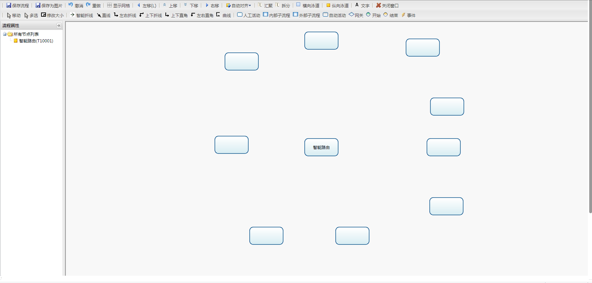
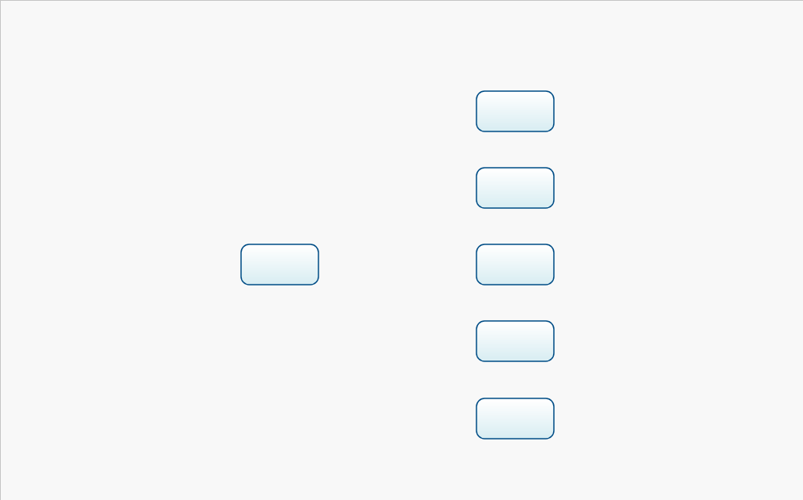
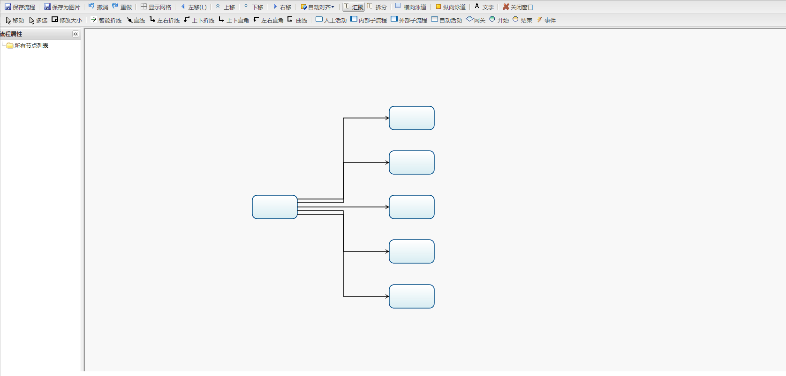
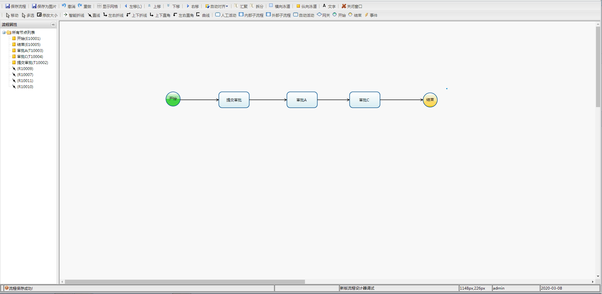
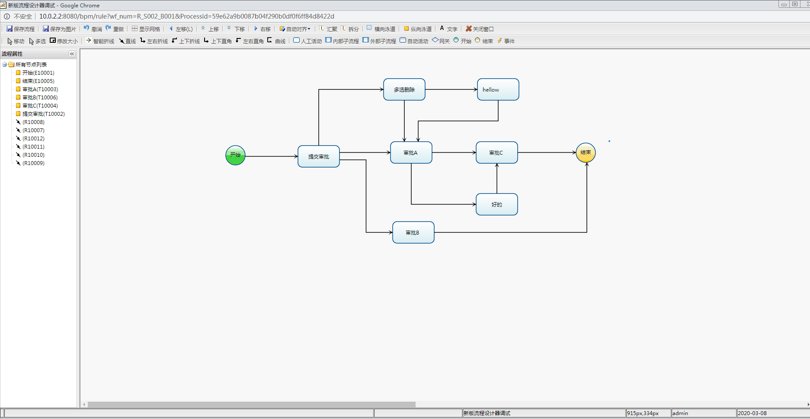

```diff
- openEA开源社区，请登录后查看更多内容！
```


# 适用版本

* 开发版本：LinkeyBPM_12_3 (osbpm_12_0)
* 适用版本：LinkeyBPM_12_0及以上版本
* 对于LinkeyBPM_9_5以下版本，不适用，需先升级SVG可缩放矢量图形标签，建议联系社区工作人员。


# 问题|优化

* 文字大小以及自动换行优化
* 新增智能折线（自动判别连接线型）
* 连线边上等距离排序
* 线的汇聚与拆分
* 增加多选删除功能
* 增加网关的缺省保存
* 允许泳道放大缩小及已知BUG
* 流程图节点基本属性在特定分辨率打开后显示空白问题
* 保存流程图为图片按照实际大小保存


# 使用手册

操作之前请自行备份。

1、升级 “202003_流程图的某个节点基本属性有时候打开后显示空白” 和 “202003_添加网关的缺省保存”两个补丁包。

2、将solution_files文件夹中的ext和ogflow文件夹直接覆盖到bpm/linkey/bpmmul目录底下。


# 测试

- 文字大小以及自动换行优化


- 新增智能折线（自动判别连接线型）



- 连线边上等距离排序



- 线的汇聚与拆分



- 允许泳道放大缩小及已知BUG



- 增加多选删除功能



- 增加网关的缺省保存
- 流程图节点基本属性在特定分辨率打开后显示空白问题
- 保存流程图为图片按照实际大小保存


# 项目地址

* 源码地址：<http://git.openea.net/osbpm-platformpack/202004-optimize-osflow>
* WIKI地址：<http://www.openea.net/index.php/%E5%8E%9F%E7%94%9F%E7%89%88%E6%9C%AC%E6%B5%81%E7%A8%8B%E8%AE%BE%E8%AE%A1%E5%99%A8V2>


# 技术交流群

QQ 群 （入群请 备注 下载渠道，需等待管理员审核）

- OpenEA开源技术交流02：748293464 
- OpenEA开源技术交流03：191456154 
- OpenEA开源技术交流04：716078623


